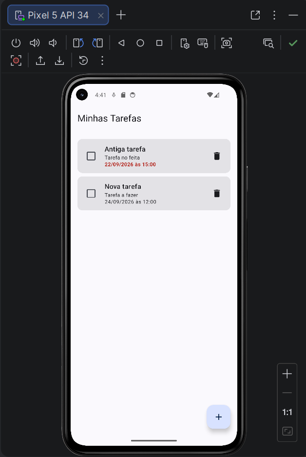
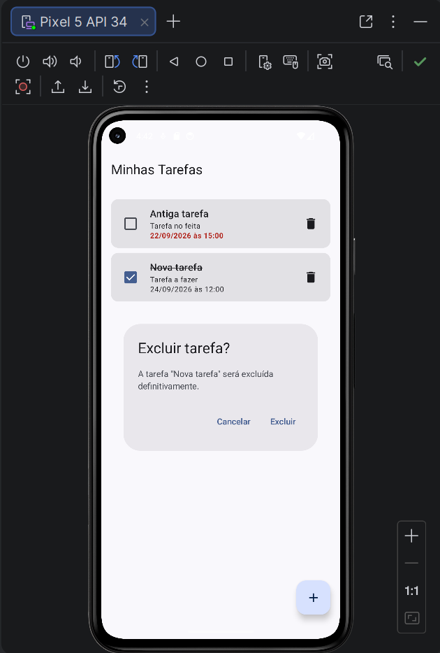
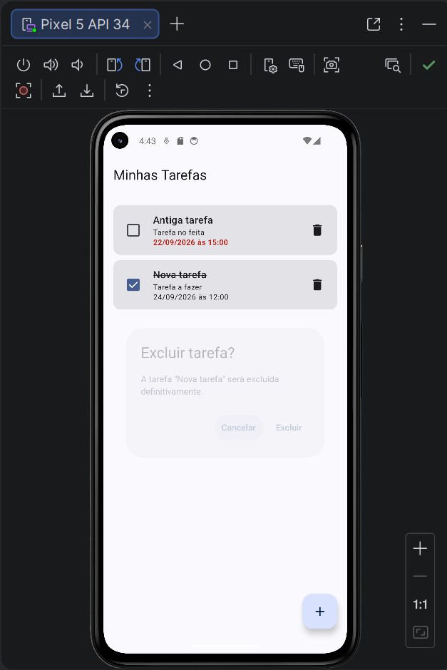
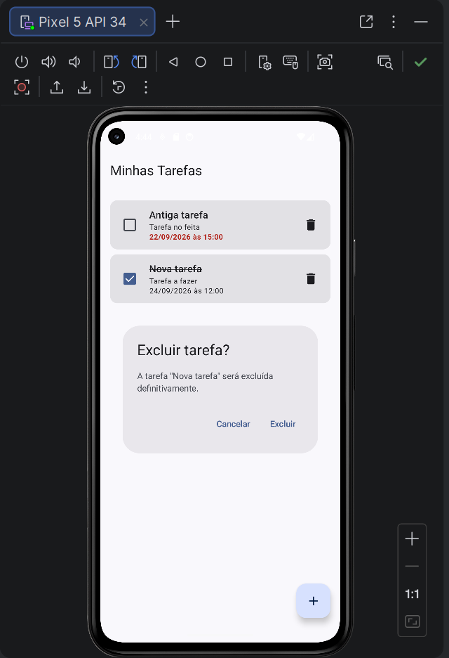
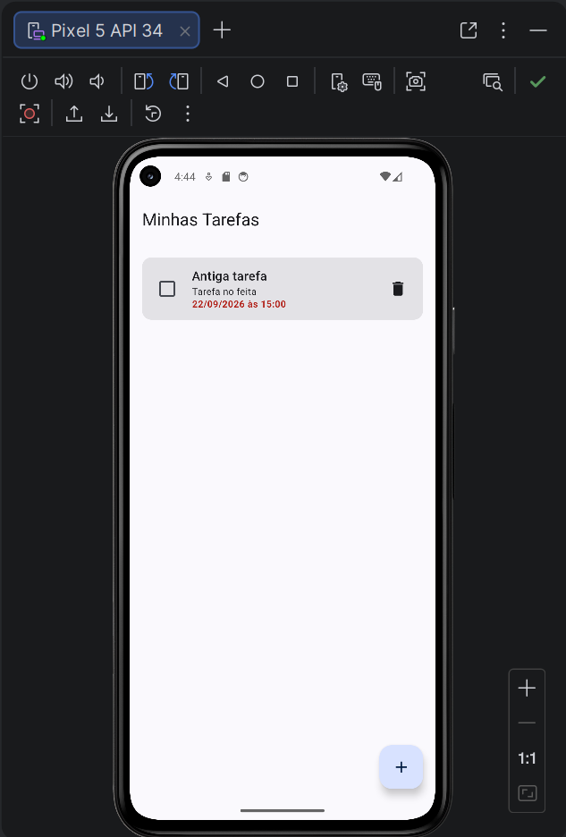

# Evidências da confirmação de exclusão

Após executar o aplicativo no emulador, salve as cinco capturas em [`docs/images/exclusao`](docs/images/exclusao/README.md), na sequência abaixo. Substitua cada marcador pela imagem Markdown correspondente; os caminhos já estão preparados.

1. **Lista antes da exclusão**

   Pendente: `docs/images/exclusao/01_lista_antes.png`

   <!--  -->

2. **Diálogo aberto com o título da tarefa selecionada**

   Pendente: `docs/images/exclusao/02_dialogo_aberto.png`

   <!--  -->

3. **Resultado após tocar em Cancelar**

   Pendente: `docs/images/exclusao/03_apos_cancelar.png`

   <!--  -->

4. **Nova abertura do diálogo**

   Pendente: `docs/images/exclusao/04_dialogo_reaberto.png`

   <!--  -->

5. **Resultado após tocar em Excluir**

   Pendente: `docs/images/exclusao/05_apos_excluir.png`

   <!--  -->
