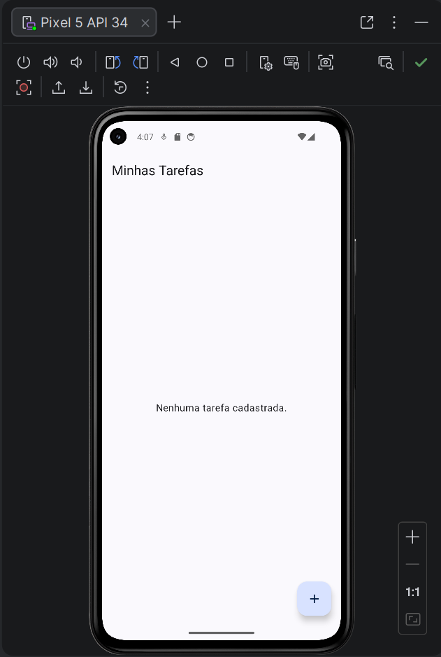
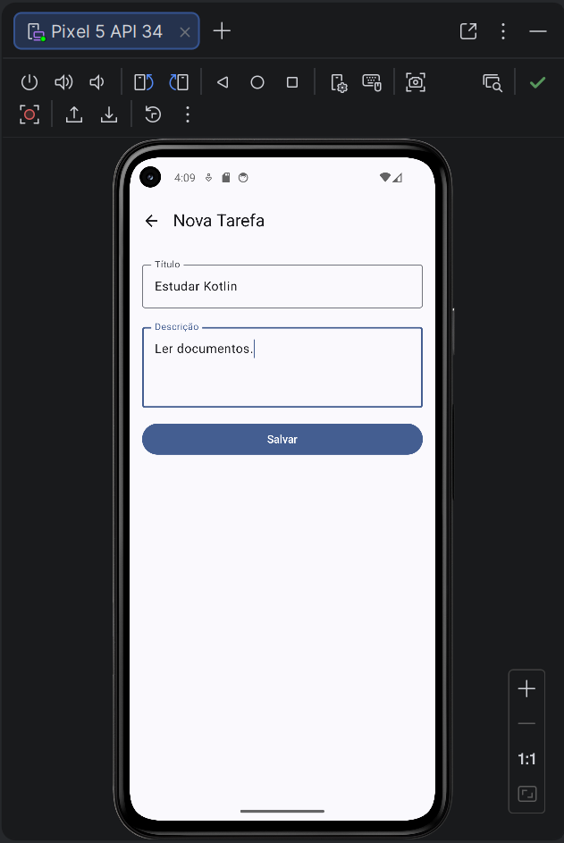
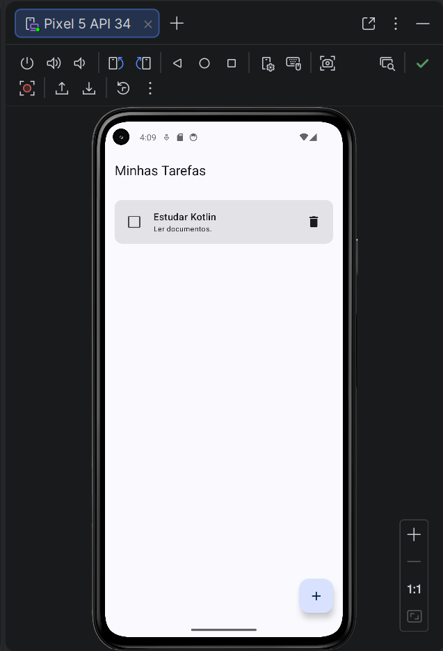
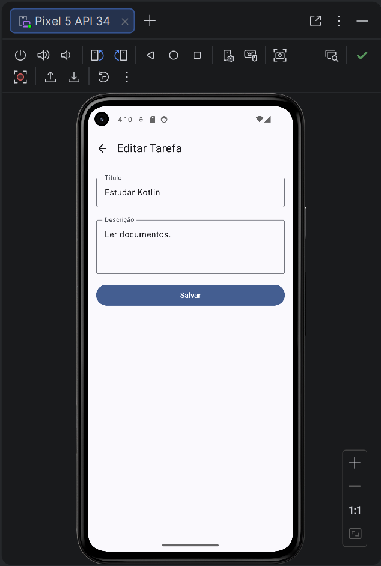
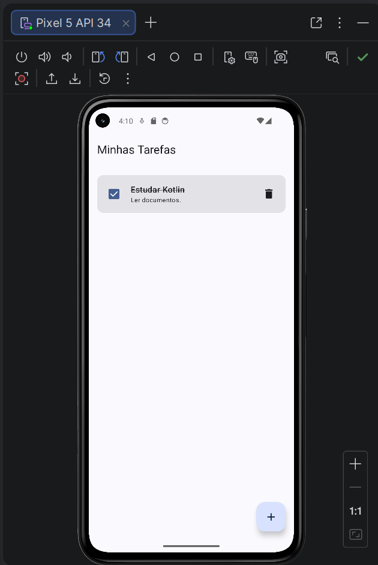
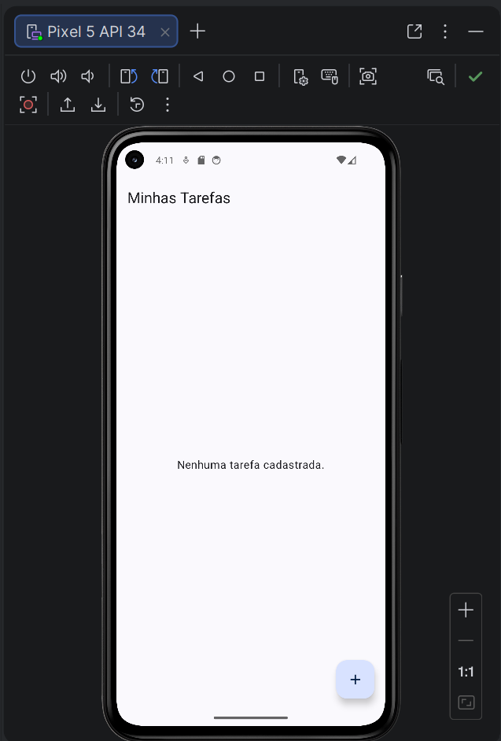
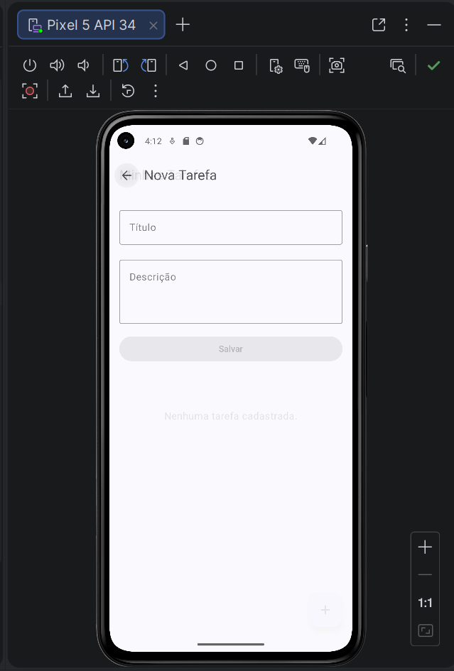
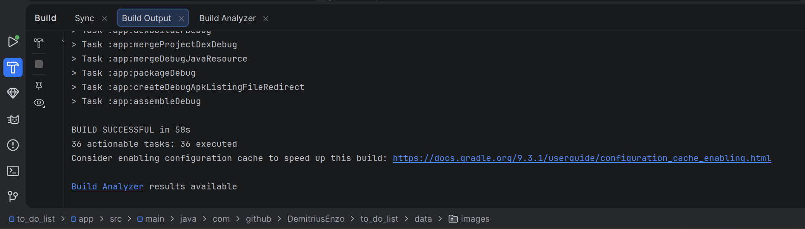

# To-Do List Android

Aplicativo Android para organizar tarefas com persistência local. Permite listar, cadastrar, editar, marcar como concluída ou pendente e excluir tarefas após confirmação. A interface tem uma tela de listagem e um formulário compartilhado entre cadastro e edição.

## Tecnologias utilizadas

- **Kotlin** para a implementação do aplicativo.
- **Jetpack Compose** e Material 3 para construir as telas e seus previews.
- **Room** para persistir as tarefas no dispositivo.
- **Coroutines e Flow** para operações assíncronas e observação das mudanças no banco.
- **ViewModel e StateFlow** para manter o estado apresentado na interface.
- **Navigation Compose** para navegar entre a lista e o formulário.

## Arquitetura

O fluxo dos dados é `Interface Compose → TarefaViewModel → TarefaRepository → TarefaDao → Room`. A entidade `Tarefa` representa os registros da tabela `tarefas` e pode guardar um prazo opcional. A migração da versão 1 para a 2 acrescenta esse campo aos bancos existentes sem apagar tarefas. `TarefaDao` oferece uma consulta que retorna `Flow<List<Tarefa>>` e operações suspensas de inserção, atualização e exclusão. `TarefaDatabase` fornece uma instância do banco local.

**TarefaRepository** centraliza o acesso ao DAO. Ele expõe o fluxo de tarefas à camada de apresentação e encaminha as operações de escrita para o banco. Assim, a ViewModel não precisa conhecer diretamente as consultas Room.

**TarefaViewModel** converte o `Flow` do repositório em `StateFlow` usando `stateIn`, para que as telas observem a lista mais recente. Executa inserções, atualizações e exclusões no `viewModelScope`. Sua `Factory` constrói a ViewModel com o DAO fornecido por `TarefaDatabase` e o repositório.

## Telas e navegação

**ListaTarefasScreen** coleta o estado com `collectAsStateWithLifecycle` e apresenta as tarefas em uma `LazyColumn`. O botão `+` abre o cadastro; tocar em um cartão abre a edição; o checkbox atualiza `concluida`; e o botão de excluir abre um diálogo Material 3 com o título da tarefa. Cancelar mantém a lista; Excluir remove somente a tarefa selecionada. Tarefas com prazo aparecem primeiro, ordenadas pelo horário mais próximo, e as atrasadas ainda pendentes recebem destaque. A tela também tem previews de lista vazia, lista preenchida e itens em estados diferentes.

**FormularioTarefaScreen** recebe `tarefaId`. O valor `0` indica uma nova tarefa; outro ID identifica uma tarefa existente e preenche título e descrição após seu carregamento. A tarefa pode receber data e horário; o botão Salvar exige um título não vazio e chama `inserir` no cadastro ou `atualizar` na edição. Depois de salvar, o formulário retorna à lista. Há previews dos dois modos.

**AppNavigation** define as rotas `lista` e `formulario/{tarefaId}`. A lista envia `0` ao criar uma tarefa ou o ID do registro ao editar; o formulário usa esse parâmetro para selecionar o modo correspondente. A navegação de volta mantém o aplicativo aberto.

**MainActivity** usa a `Factory` de `TarefaViewModel` para criar a ViewModel, aplica o tema Compose e inicia `AppNavigation`, que abre a lista como tela inicial.

## Como executar

1. Abra a pasta raiz deste repositório no Android Studio e aguarde a sincronização do Gradle. Instale os componentes Android SDK solicitados pelo projeto se a IDE pedir.
2. Inicie um emulador ou conecte um dispositivo com Android API 24 ou superior.
3. Selecione a configuração `app` e clique em **Run**. Pelo terminal no Windows, você também pode verificar o build com `gradlew.bat :app:assembleDebug`.
4. Na lista, toque em `+` para cadastrar uma tarefa. Toque no cartão para editar, no checkbox para concluir ou desmarcar, e no ícone da lixeira para abrir a confirmação de exclusão. O prazo pode ser definido no formulário.

## Evidências

As capturas abaixo foram registradas no emulador e estão em [`docs/evidencias`](docs/evidencias/README.md).

### Tela inicial

### Formulário de cadastro

### Tarefa cadastrada na lista

### Edição de tarefa

### Tarefa concluída

### Exclusão de tarefa

### Navegação entre telas

### Build sem erros

O roteiro das cinco capturas específicas do fluxo de confirmação está em [`EVIDENCIAS_EXCLUSAO.md`](EVIDENCIAS_EXCLUSAO.md).
